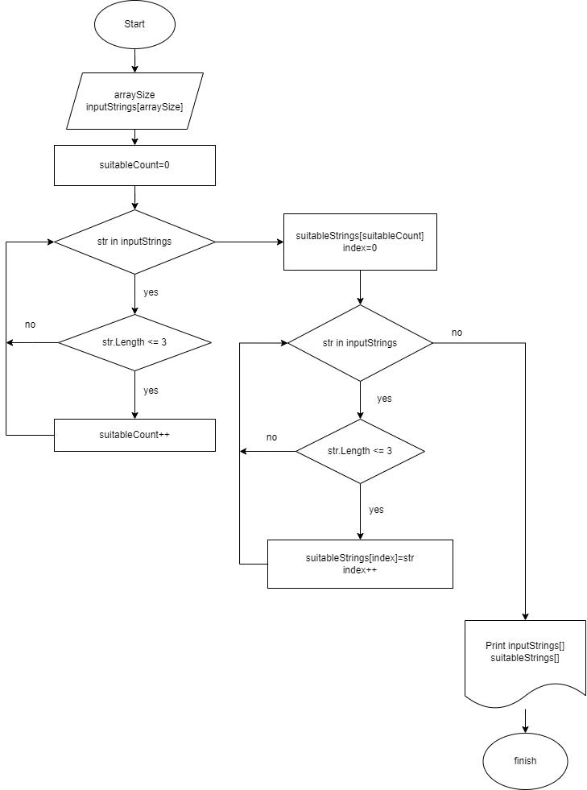

# Задача: #
Написать программу, которая из имеющегося массива строк формирует массив из строк, длина которых меньше либо равна 3 символам. Первоначальный массив можно ввести с клавиатуры, либо задать на старте выполнения алгоритма. При решении не рекомендуется пользоваться коллекциями, лучше обойтись исключительно массивами.


## Описание алгоритма решения задачи

В структуре программы используются следующие методы:

- Main метод является точкой входа и координирует выполнение программы.
- RequestArraySize запрашивает у пользователя размер массива.
- ReadInputStrings читает строки, введенные пользователем, и сохраняет их в массиве.
- FilterStrings фильтрует строки, оставляя только те, что подходят по условию (длина <= 3 символов).
- CountSuitableStrings считает количество подходящих строк в массиве.
- DisplayResults выводит исходный и отфильтрованный массивы на экран.

**Шаг 1:**
Запрос размера массива строк у пользователя.

**Шаг 2:** 
Ввод данных пользователем и сохранение в массиве.

**Шаг 3:** 
Подсчет подходящих строк (длина не более 3 символов).

**Шаг 4:**
Выделение памяти под новый массив с подходящими строками.

**Шаг 5:**
Заполнение нового массива подходящими строками.

**Шаг 6:**
Вывод результатов
[Базовый массив ];
[Новый массив].

___
В данном решении нет использования коллекций. Весь код работает только с массивами.

```csh
string[] inputStrings
``` 
и

```csh
string[] suitableStrings
```
Блок-схема изображена ниже на рисунке

